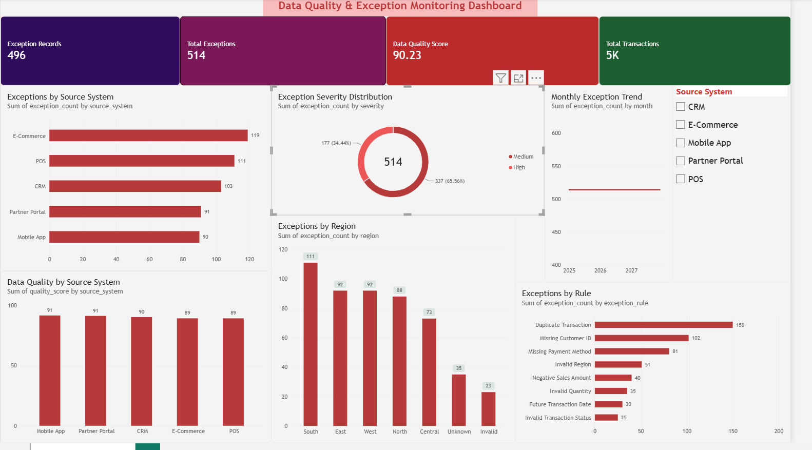

# Data Quality & Exception Monitoring Dashboard

A data quality monitoring project built using **Python, Pandas, SQL, SQLite, and Power BI** to identify, analyze, and visualize data quality issues in retail transaction data.

The project demonstrates an end-to-end analytics workflow — from data generation and validation to SQL analysis and interactive Power BI reporting.

---

## Project Overview

Data quality issues such as missing values, duplicates, invalid attributes, negative amounts, and incorrect dates can affect downstream reporting and business decisions.

This project simulates a retail transaction environment and builds a reusable data quality pipeline that:

* Generates a realistic transaction dataset
* Introduces controlled data quality issues
* Validates records using predefined business rules
* Creates record-level exception details
* Stores validated data and exceptions in SQLite
* Performs analytical queries using SQL
* Exports analytical datasets for Power BI
* Visualizes data quality metrics and exception patterns

---

## Technology Stack

| Technology   | Purpose                                 |
| ------------ | --------------------------------------- |
| Python       | Data generation and quality validation  |
| Pandas       | Data processing and transformation      |
| SQL          | Data analysis and quality reporting     |
| SQLite       | Local analytical database               |
| Power BI     | Interactive dashboard and visualization |
| Git & GitHub | Version control and project management  |

---

## Data Quality Pipeline

```text
Retail Transaction Data
          │
          ▼
   Python Data Generation
          │
          ▼
  Data Quality Validation
          │
          ├── Missing Customer ID
          ├── Duplicate Transaction
          ├── Invalid Region
          ├── Negative Sales Amount
          ├── Invalid Quantity
          ├── Future Transaction Date
          ├── Missing Payment Method
          └── Invalid Transaction Status
          │
          ▼
   Validated Transactions
          │
          ├──────────────► Data Quality Summary
          │
          └──────────────► Exception Details
                              │
                              ▼
                         SQLite Database
                              │
                              ▼
                         SQL Analysis
                              │
                              ▼
                       Power BI Dashboard
```

---

## Dataset

The project uses a simulated retail transaction dataset containing **5,075 transaction records**.

Each transaction contains fields such as:

* Transaction ID
* Customer ID
* Transaction Date
* Region
* Product Category
* Sales Amount
* Quantity
* Payment Method
* Source System
* Transaction Status

The dataset intentionally contains data quality issues to simulate real-world data validation scenarios.

---

## Data Quality Rules

The pipeline checks transactions against eight validation rules:

| Rule                       | Severity |
| -------------------------- | -------- |
| Missing Customer ID        | High     |
| Duplicate Transaction      | Medium   |
| Invalid Region             | Medium   |
| Negative Sales Amount      | High     |
| Invalid Quantity           | High     |
| Future Transaction Date    | Medium   |
| Missing Payment Method     | Medium   |
| Invalid Transaction Status | Medium   |

---

## Data Quality Results

The validation pipeline produced the following results:

| Metric             |     Result |
| ------------------ | ---------: |
| Total Transactions |      5,075 |
| Valid Records      |      4,579 |
| Exception Records  |        496 |
| Total Exceptions   |        514 |
| Data Quality Score | **90.23%** |

The distinction between **exception records** and **total exceptions** is important. A single transaction can contain multiple data quality issues, so the number of individual exceptions can be greater than the number of affected records.

### Exceptions by Rule

| Rule                       | Exceptions |
| -------------------------- | ---------: |
| Duplicate Transaction      |        150 |
| Missing Customer ID        |        102 |
| Missing Payment Method     |         81 |
| Invalid Region             |         51 |
| Negative Sales Amount      |         40 |
| Invalid Quantity           |         35 |
| Future Transaction Date    |         30 |
| Invalid Transaction Status |         25 |

---

## SQL Analysis

SQLite was used to create an analytical database containing:

* `transactions`
* `exceptions`

SQL analysis was performed to identify:

* Overall data quality
* Exception counts by rule
* Exception distribution by source system
* Exception distribution by region
* Monthly exception trends
* High-severity exceptions
* Transactions with multiple issues
* Source-system quality rankings
* Exception severity distribution
* Problem areas by source and rule
* Exception rates by source system

The project also includes reusable SQL views for Power BI reporting.

---

## Power BI Dashboard

The project includes an interactive Power BI dashboard designed to monitor data quality and identify major exception areas across transactions and source systems.

### Dashboard Highlights

- **Data Quality Score:** 90.23%
- **Total Transactions:** 5,075
- **Exception Records:** 496
- **Total Exceptions:** 514
- Exception analysis by validation rule
- Exception distribution by source system
- Exception distribution by region
- Monthly exception trend
- Data quality comparison across source systems
- High vs. Medium severity analysis

### Dashboard Preview



### Power BI Report

The Power BI report file is available in the `powerbi` folder.

[Download the Power BI Dashboard](powerbi/Data_Quality_Dashboard.pbix)

The `.pbix` file can be opened using Power BI Desktop.


### Dashboard includes

* Data Quality Score
* Total Transactions
* Exception Records
* Total Exceptions
* Exceptions by Rule
* Exceptions by Source System
* Exceptions by Region
* Monthly Exception Trend
* Data Quality by Source System
* Exception Severity Distribution

### Data Quality by Source System

| Source System  | Quality Score |
| -------------- | ------------: |
| Mobile App     |        91.49% |
| Partner Portal |        91.13% |
| CRM            |        90.17% |
| E-Commerce     |        89.15% |
| POS            |        89.14% |

These values are descriptive outputs from the simulated dataset and are intended to demonstrate the analytical workflow.

---

## Project Structure

```text
data-quality-exception-monitoring/
│
├── data/
│   ├── raw/
│   │   └── retail_transactions.csv
│   │
│   └── processed/
│       ├── validated_transactions.csv
│       ├── data_quality_exceptions.csv
│       ├── data_quality_summary.csv
│       ├── exception_by_region.csv
│       ├── exception_by_rule.csv
│       ├── exception_by_source.csv
│       ├── monthly_exceptions.csv
│       └── source_quality_summary.csv
│
├── powerbi/
│   ├── vw_quality_summary.csv
│   ├── vw_source_quality.csv
│   ├── vw_exception_analysis.csv
│   ├── vw_exception_by_source.csv
│   ├── vw_exception_by_region.csv
│   ├── vw_monthly_exceptions.csv
│   ├── vw_exception_severity.csv
│   └── vw_exception_details.csv
│
├── python/
│   ├── generate_data.py
│   ├── data_quality_pipeline.py
│   ├── create_analytics_tables.py
│   ├── load_sqlite_database.py
│   ├── create_sql_views.py
│   ├── run_sql_analysis.py
│   └── export_powerbi_data.py
│
├── sql/
│   ├── analysis_queries.sql
│   └── create_views.sql
│
├── README.md
├── requirements.txt
└── .gitignore
```

---

## How to Run

### 1. Clone the repository

```bash
git clone https://github.com/Anand-bit20/data-quality-exception-monitoring.git
cd data-quality-exception-monitoring
```

### 2. Install dependencies

```bash
pip install -r requirements.txt
```

### 3. Generate the dataset

```bash
python python/generate_data.py
```

### 4. Run the data quality pipeline

```bash
python python/data_quality_pipeline.py
```

### 5. Create analytical datasets

```bash
python python/create_analytics_tables.py
```

### 6. Create the SQLite database

```bash
python python/load_sqlite_database.py
```

### 7. Create SQL views

```bash
python python/create_sql_views.py
```

### 8. Run SQL analysis

```bash
python python/run_sql_analysis.py
```

### 9. Export datasets for Power BI

```bash
python python/export_powerbi_data.py
```

The resulting CSV files in the `powerbi/` directory can then be imported into Power BI Desktop.

---

## Key Learning Outcomes

This project provided practical experience with:

* Data quality validation
* Exception handling
* Data profiling
* Python/Pandas data processing
* SQL analytical queries
* SQL views
* SQLite database management
* Data aggregation
* Data quality metrics
* Power BI dashboard development
* Data visualization
* Git and GitHub version control
* End-to-end analytics workflow design

---

## Future Improvements

Potential improvements include:

* Implementing a proper dimensional/star schema
* Connecting Power BI directly to the analytical database
* Adding dynamic DAX-based data quality measures
* Adding automated data quality alerts
* Scheduling the pipeline using Apache Airflow
* Adding automated unit tests for validation rules
* Extending the pipeline to support additional source systems
* Adding historical data quality monitoring

---


## Author

**Anand Parayan**

Data & Analytics Specialist | Python | SQL | Power BI | Data Quality | Automation
